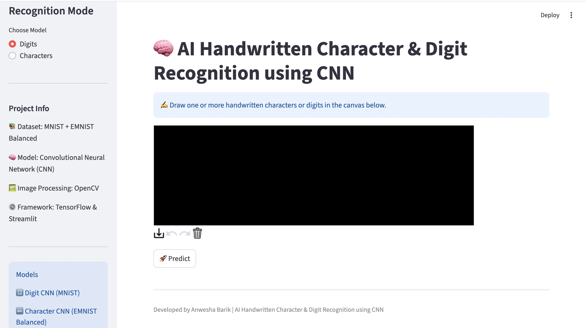
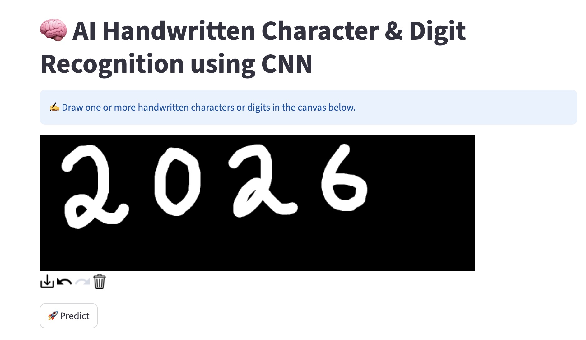
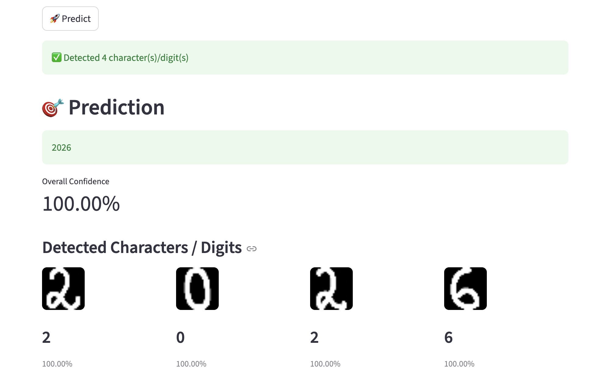

# ✍️ AI Handwritten Character & Digit Recognition using CNN

An AI-powered handwritten recognition system that identifies handwritten **digits** and **alphabet characters** using **Convolutional Neural Networks (CNNs)**. The project combines image preprocessing, deep learning, and an interactive Streamlit web application to provide real-time predictions with confidence scores.

The system is trained using the **MNIST** dataset for handwritten digits and the **EMNIST Balanced** dataset for handwritten characters. It supports interactive handwriting input and demonstrates how deep learning can be applied to handwriting recognition tasks.

---

# 📌 Project Overview

Handwritten character recognition is one of the most important applications of computer vision and deep learning. It is widely used in document digitization, postal mail sorting, bank cheque processing, educational tools, and OCR (Optical Character Recognition) systems.

This project uses image preprocessing techniques and Convolutional Neural Networks (CNNs) to recognize handwritten digits and alphabet characters. Users can draw handwritten input using an interactive canvas, and the trained models predict the corresponding digit or character along with a confidence score.

The application is developed using **Python**, **TensorFlow**, **OpenCV**, and **Streamlit**, providing an easy-to-use graphical interface for real-time handwriting recognition.

---

# 🎯 Objectives

- Recognize handwritten digits and alphabet characters.
- Apply image preprocessing techniques before prediction.
- Train CNN models using benchmark handwriting datasets.
- Compare handwritten input against trained deep learning models.
- Build an interactive Streamlit web application.
- Demonstrate the application of deep learning in handwriting recognition.

---

# ✨ Features

- 🔢 Handwritten Digit Recognition
- 🔤 Handwritten Character Recognition
- ✍️ Interactive Drawing Canvas
- 🧠 CNN-based Deep Learning Models
- 📊 Real-time Prediction
- 📈 Confidence Score
- 🎨 Streamlit Web Interface
- 🖼️ Image Preprocessing using OpenCV
- 📚 Support for MNIST and EMNIST Balanced datasets

---

# 📊 Datasets

## MNIST Dataset

The MNIST dataset is used to train the handwritten digit recognition model. It contains grayscale images of handwritten digits (0–9), each resized to **28 × 28 pixels**.

### Applications

- Digit Recognition
- OCR Systems
- Educational AI Projects

---

## EMNIST Balanced Dataset

The EMNIST Balanced dataset extends the MNIST dataset by including handwritten alphabet characters and additional symbols.

It is used to train the handwritten character recognition model.

### Applications

- Character Recognition
- OCR
- Document Digitization
- Handwritten Text Analysis

---

# 🧠 Deep Learning Model

The project uses **Convolutional Neural Networks (CNNs)** for both handwritten digit and character recognition.

### CNN Architecture

- Convolution Layers
- Batch Normalization
- Max Pooling
- Dropout
- Fully Connected Dense Layers
- Softmax Output Layer

The CNN automatically extracts important image features, making it highly effective for handwritten image classification.

---

# 📈 Model Performance

The handwritten recognition system was trained using separate CNN models for digits and characters.

| Model | Dataset | Accuracy |
|-------|---------|---------:|
| Handwritten Digit Recognition | MNIST | **98–99%** |
| Handwritten Character Recognition | EMNIST Balanced | **82.28%** |

### Model Highlights

- CNN provides high accuracy for handwritten image classification.
- The digit recognition model achieves excellent performance on the MNIST dataset.
- The character recognition model successfully recognizes handwritten alphabet characters using the EMNIST Balanced dataset.
- Confidence scores are displayed along with every prediction.

---

# 📷 Application Screenshots

## 🏠 Home Page

The home page provides an interactive interface where users can select the recognition mode (Digits or Characters), view project information, and access the handwriting canvas.



---

## ✍️ Drawing Canvas

Users can draw one or more handwritten digits or alphabet characters on the interactive canvas before running the prediction.



---

## 🎯 Prediction Result

The application segments the handwritten input, predicts each digit or character using the trained CNN model, and displays the overall confidence score.



---

# 🛠️ Technologies Used

- Python
- TensorFlow
- Keras
- OpenCV
- NumPy
- Pandas
- Streamlit
- Streamlit Drawable Canvas
- Matplotlib

---

# 📂 Project Structure

```text
Handwritten_Character_Recognition/
│── app.py
│── predictor.py
│── preprocess.py
│── segment.py
│── character_mapping.py
│── train_digit_model.py
│── train_character_model.py
│── test_predictor.py
│── test_multiple.py
│── emnist-balanced-mapping.txt
│── requirements.txt
│── README.md
│── .gitignore
│
├── models/
│   ├── handwritten_cnn_model.h5
│   ├── handwritten_cnn_model.keras
│   └── character_model.h5
│
├── screenshots/
│   ├── home_page.png
│   ├── drawing_canvas.png
│   ├── prediction_result.png
│   └── about_project.png
│
└── venv/
```

---

# 🚀 Installation

Clone the repository:

```bash
git clone https://github.com/anwesha20062013/Handwritten_Character_Recognition.git
```

Move into the project folder:

```bash
cd Handwritten_Character_Recognition
```

Install the required dependencies:

```bash
pip install -r requirements.txt
```

Train the digit recognition model:

```bash
python train_digit_model.py
```

Train the character recognition model:

```bash
python train_character_model.py
```

Run the Streamlit application:

```bash
streamlit run app.py
```

---

# 📖 How to Use

1. Launch the Streamlit application.
2. Select Digit Recognition or Character Recognition.
3. Draw a handwritten digit or alphabet character on the canvas.
4. Click **Predict**.
5. View the predicted result and confidence score.

---

# ⭐ Future Improvements

- Recognize complete handwritten words using sequence models.
- Extend the system for handwritten sentence recognition using **CRNN (Convolutional Recurrent Neural Networks)**.
- Improve segmentation for connected handwriting.
- Support cursive handwriting recognition.
- Deploy the application using Streamlit Community Cloud.
- Add support for uploading handwritten images.

---

# ⚠️ Disclaimer

This project is developed for **educational and research purposes only**. The predictions generated by the deep learning models are intended to demonstrate the application of Convolutional Neural Networks in handwritten character recognition and should not be considered a replacement for professional OCR systems.

---

# 👩‍💻 Author

**Anwesha Barik**

B.Tech Computer Science & Engineering (AI & ML)

GitHub: https://github.com/anwesha20062013

---

## ⭐ If you found this project useful, consider giving it a star on GitHub!